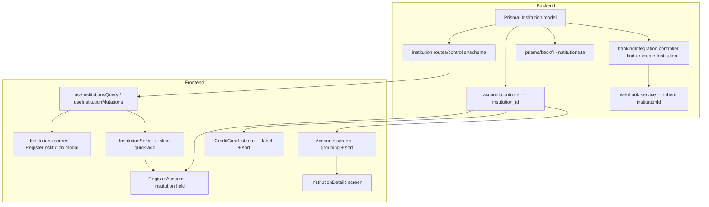
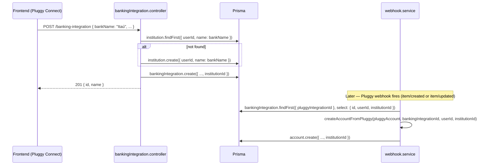

# Design — Account Institutions

Companion to `spec.md`. This document pins down exact API contracts, file
structure, and sequencing — grounded in patterns already used for `Tag` and
`Category` (the closest analogues to `Institution` in this codebase).

---

## 1. Architecture Overview



**Build order:** Backend schema (R1-R2) → Backend API + Pluggy linking
(R3-R7) → Frontend data layer (R8-R9) → Frontend screens (R10-R15). The
frontend cannot meaningfully start until the API contracts below are final,
since `AccountProps.institution` and the new endpoints are consumed directly.

---

## 2. Data Model (final)

```prisma
model Institution {
  id        String   @id @default(uuid())
  userId    String   @map("user_id")
  name      String
  createdAt DateTime @default(now()) @map("created_at")
  updatedAt DateTime @updatedAt @map("updated_at")

  user                User                 @relation(fields: [userId], references: [id], onDelete: Cascade)
  accounts            Account[]
  bankingIntegrations BankingIntegration[]

  @@unique([userId, name])
  @@map("institutions")
}
```

- `Account.institutionId String? @map("institution_id")` + relation
  `institution Institution? @relation(fields: [institutionId], references: [id], onDelete: SetNull)`
- `BankingIntegration.institutionId String? @map("institution_id")` + same
  `onDelete: SetNull` relation shape
- `User.institutions Institution[]` added to the relations block

No index beyond the `@@unique([userId, name])` is needed — institution
lists are small (tens, not thousands, per user) and always filtered by
`userId` first.

---

## 3. API Contracts

All routes under `/api/v1/institution`, authenticated via the existing
`authenticate` middleware, validated via the existing `validate(schema, target)`
middleware — same shape as `tag.routes.ts`.

### `GET /institution`
Response `200`:
```json
[
  { "id": "uuid", "name": "Itaú" },
  { "id": "uuid", "name": "Nubank" }
]
```
Ordered by `name` ascending (differs from `tag`'s `createdAt desc` — sorted
lists read better for a picker).

### `POST /institution`
Request: `{ "name": "Itaú" }`
Response `201`: `{ "id": "uuid", "name": "Itaú" }`
Response `409` (name already exists for this user):
`{ "error": "Institution with this name already exists" }`
— the frontend's inline quick-add treats this as a soft conflict, not a hard
failure (AC11.5): on `409` it refetches `GET /institution` and selects the
existing entry whose `name` matches (case-insensitive compare), rather than
surfacing an error dialog.

### `GET /institution/:id`
Response `200`: `{ "id": "uuid", "name": "Itaú" }`
Response `404` if not found or not owned by the requesting user.

### `PATCH /institution/:id`
Request: `{ "name": "Itaú Unibanco" }`
Response `200`: `{ "id": "uuid", "name": "Itaú Unibanco" }`

### `DELETE /institution/:id`
Response `200`: `{ "success": true, "message": "Institution deleted successfully" }`
Side effect: all `Account.institutionId` and `BankingIntegration.institutionId`
rows pointing at it become `null` (`onDelete: SetNull` — Prisma applies this
on explicit `.delete()` calls just like it does for existing `Budget.account`
`SetNull` relation, so no manual unlinking step is needed in the controller).

**Zod schemas** (`institution.schema.ts`, mirrors `tag.schema.ts` exactly):
```ts
export const createInstitutionSchema = z.object({
  name: z.string().min(1, "Institution name is required").max(50),
});
export const updateInstitutionSchema = z.object({
  name: z.string().min(1, "Institution name is required").max(50).optional(),
});
export const institutionIdParamSchema = z.object({
  id: z.string().uuid("Institution ID must be a valid UUID"),
});
```

### Account endpoints — additive changes only

`createAccountSchema` / `updateAccountSchema` gain:
```ts
institution_id: z.string().uuid().nullable().optional(),
```

All formatted account responses (`getAccounts`, `getAccountById`,
`createAccount`, `updateAccount`) gain, alongside the existing
`bankingIntegration` block:
```json
"institution": { "id": "uuid", "name": "Itaú" } | null
```
fetched via `include: { institution: { select: { id: true, name: true } } }`
next to the existing `bankingIntegration` include (`account.controller.ts`
~L20-30, ~L107-117, ~L242-244, ~L395-397).

---

## 4. Backend — Pluggy Auto-Linking Sequence



**Implementation notes:**
- `createAccountFromPluggy`'s signature gains a 4th param, `institutionId:
  string | null`, threaded through from both call sites
  (`handleItemUpdated` already has `integration.institutionId` available
  since it already fetches the full `integration` object; `handleItemCreated`
  must add `institutionId: true` to its existing `select: { id, userId }`)
- The find-or-create in `createBankingIntegration` must handle the race
  where two requests connect the same bank concurrently — rely on the
  `@@unique([userId, name])` constraint: catch Prisma's `P2002` unique
  violation on `institution.create` and re-fetch by `(userId, name)` instead
  of failing the whole request

---

## 5. Backend — Backfill Script

Follows the existing `prisma/seed.ts` convention (a standalone `tsx`-run
script, not a new `scripts/` directory).

- **File:** `smart-finances-backend/prisma/backfill-institutions.ts`
- **Invocation:** add `"backfill:institutions": "tsx prisma/backfill-institutions.ts"` to `package.json` scripts; run once manually against production after deploying the migration
- **Logic:**
  1. `SELECT DISTINCT userId, bankName FROM banking_integrations WHERE institutionId IS NULL`
  2. For each pair, `institution.upsert` on `(userId, name: bankName)` (upsert instead of find-then-create avoids a second race-condition class since this runs once, offline, sequentially)
  3. `UPDATE banking_integrations SET institutionId = ? WHERE userId = ? AND bankName = ? AND institutionId IS NULL`
  4. `UPDATE accounts SET institutionId = ? WHERE bankingIntegrationId IN (SELECT id FROM banking_integrations WHERE institutionId = ?)`
  5. Log a per-user summary count; exit non-zero on any row-level failure so it's obviously safe to re-run (idempotent via the `IS NULL` guards)

---

## 6. Frontend — File Plan & Exact Patterns

Institution is simpler than Category (name-only, no icon/color), so
`RegisterInstitution` is a single-field form — do **not** copy Category's
icon/color picker machinery.

### Data layer
| File | Pattern source | Notes |
|---|---|---|
| `src/interfaces/institutions.ts` | `interfaces/categories.ts` (shape only) | `InstitutionProps { id: string; name: string }` |
| `src/hooks/useInstitutionsQuery.ts` | `useCategoriesQuery.ts` | `queryKey: ['institutions']`, `queryFn: () => api.get('institution')` |
| `src/hooks/useInstitutionMutations.ts` | `useTagMutations.ts` (file groups 3 named hook exports, not one combined hook) | `useCreateInstitutionMutation`, `useUpdateInstitutionMutation`, `useDeleteInstitutionMutation` — each with the same optimistic-update `onMutate`/`onError`/`onSettled` shape as the Tag mutations, invalidating `['institutions']` |
| `src/stores/currentInstitutionSelectedStorage.ts` | `currentAccountSelectedStorage.ts` | `{ institutionId: string \| null; institutionName: string \| null; setInstitution: (id, name) => void; clearInstitution: () => void }` — deliberately minimal, no persisted balance (recomputed client-side on the details screen) |
| `src/interfaces/accounts.ts` | — | `AccountProps` gains `institution?: { id: string; name: string } \| null` |

### Institution management (mirrors `Categories`/`RegisterCategory` exactly)
| File | Notes |
|---|---|
| `src/screens/Institutions/index.tsx` + `styles.ts` | List screen: `FlatList` of institutions + `ListFooterComponent` "Criar Nova Instituição" button + `ModalView` bottom sheet (like `Categories`'s `bottomSheetRef` pattern) hosting `RegisterInstitution` |
| `src/screens/RegisterInstitution/index.tsx` + `styles.ts` | Single `ControlledInput` (name) + React Hook Form + Yup (`name: Yup.string().required(...)`), `useCreateInstitutionMutation`/`useUpdateInstitutionMutation`, no icon/color state at all |
| `src/components/InstitutionListItem/index.tsx` (for the management list) | Simple name row, mirrors `TagListItem` more than `CategoryListItem` (no icon/color swatch) |

Entry point: add an "Instituições" row wherever "Categorias"/"Etiquetas" are
currently reachable from (`OptionsMenu` — verify exact location during
implementation, not assumed here).

### Institution picker (mirrors `CategorySelect`)
| File | Notes |
|---|---|
| `src/screens/InstitutionSelect/index.tsx` + `styles.ts` | `FlatList` of institutions from `useInstitutionsQuery`, single-column rows (not `numColumns={4}` grid like `CategorySelect` — institutions are text rows, not icon tiles) |
| Inline quick-add | Rendered as a footer row inside `InstitutionSelect` (`ListFooterComponent`): tapping "+ Nova instituição" swaps it for a `TextInput` + confirm button in local `useState`; on submit calls `useCreateInstitutionMutation`, and on `409` falls back to selecting the existing match per the API contract above (§3) |

### `RegisterAccount` changes
- New `SelectButton`-style row "Instituição financeira" (or "(opcional)"
  suffix per AC11.4), opening a `ModalViewSelection` → `InstitutionSelect`,
  same wiring already used for the currency/account-type selectors in this
  screen
- Conditional-required validation lives in the existing Yup schema: add
  `institution_id` as a field that's `.required()` only when
  `typeSelected` is `BANK`/`INVESTMENTS`/`CREDIT` (Yup `.when('type', ...)`)
- Payload (`handleRegisterAccount`/`handleEditAccount`) includes
  `institution_id: institutionSelected?.id ?? null`

### Accounts screen changes
- `processedData` (currently ~L117-235): after computing `processedAccounts`,
  partition into `{ grouped: Map<institutionId, AccountProps[]>, standalone: AccountProps[] }` using the existing non-credit-card filter (`type !== 'CREDIT'`)
- Institutions whose group has length 1 get moved into `standalone` (AC12.3's
  bypass rule) — this reclassification happens once per render inside
  `useMemo`, not as a separate pass
- Build a new `institutionCards: { id, name, total, count }[]` from
  `grouped` entries with length ≥ 2, reusing the existing per-account
  `accountBalanceConvertedToBRL` conversion (already computed at ~L132-151)
  summed per group
- Merge `institutionCards` (mapped to a common shape) and `standalone`
  accounts into one array, sort: institutions block (alpha by `name`)
  concatenated with standalone block (alpha by `name`) — two `Array.sort()`
  calls concatenated, not one combined comparator, to guarantee the
  "institutions first" grouping regardless of name collisions
- `_renderItem` gains a type discriminator (`'institution' | 'account'`) to
  choose between the new `InstitutionListItem` (navigates to
  `InstitutionDetails`, setting `useCurrentInstitutionSelected` first) and
  the existing `AccountListItem` branch (unchanged)

### `InstitutionDetails` screen
| File | Notes |
|---|---|
| `src/screens/InstitutionDetails/index.tsx` + `styles.ts` | Reads `institutionId`/`institutionName` from `useCurrentInstitutionSelected`; filters the existing `useAccountsQuery` cache (no new fetch) by `account.institution?.id === institutionId`; groups into sections by `type`/`subtype` per AC14.4; renders a `SectionList` (new to this screen — no existing precedent for sectioned account lists, so this is a genuinely new UI pattern, not copied) |
| Route | `src/app/(app)/accounts/institutionDetails.tsx` (default-exports the screen, mirrors `bankingIntegrationDetails.tsx`); registered in `src/app/(app)/accounts/_layout.tsx` alongside the existing `bankingIntegrations`/`bankingIntegrationDetails` entries |

### Credit card carousel
- `CreditCardListItem`: add a small `Text` label above/below the account
  name when `data.institution` is present, styled like
  `AccountConnectedListItem`'s "Inst. Financeira:" line (~L35-37) but more
  compact given the card's limited width
- Sort applied where the carousel's `data` prop is built (`Accounts/index.tsx`
  ~L509-513): `.sort()` comparator — institution name (accounts without one
  sort last) then account name as tiebreaker

---

## 7. Edge Cases & Decisions Made During Design

- **`institution.create` unique-violation race** (two concurrent requests,
  same new bank name): handled via catch-`P2002`-and-refetch in the backend
  (§4), not left to the frontend to detect.
- **Deleting an institution with accounts attached**: allowed, relies on
  `onDelete: SetNull` — confirmed this is the same pattern already used by
  `Budget.account` (`onDelete: SetNull`), so no new Prisma behavior is being
  introduced.
- **Institution becomes single-account after a delete/edit elsewhere**
  (e.g., user deletes their last-but-one Itaú account): no special handling
  needed — the bypass rule in `processedData` (AC12.3) is computed fresh on
  every render from current data, so it self-corrects automatically.
- **`InstitutionDetails` staleness**: since it reads from the shared
  `useAccountsQuery` cache rather than fetching independently, it's always
  consistent with whatever the Accounts screen just displayed — no extra
  invalidation wiring needed.
- **Currency mixing within one institution**: an institution's aggregated
  total already goes through each account's existing BRL-conversion step
  before summing (AC13.1), so multi-currency institutions (e.g., a USD
  investment account and a BRL checking account both at the same broker)
  aggregate correctly without new conversion logic.

---

## 8. Suggested Task Batching (for the Tasks phase)

Given ~30-35 atomic tasks across two repos, phases should split as:

1. **Backend — schema & migration** (R1, R2) — must land first, blocks everything else
2. **Backend — Institution CRUD API** (R3) — independent of Pluggy work
3. **Backend — Account API + Pluggy linking + backfill** (R4, R5, R6, R7) — depends on phase 1
4. **Frontend — data layer** (R8, R9) — depends on phases 2-3 being deployed/available to point at (or a local dev backend)
5. **Frontend — institution management + picker** (R10, R11) — depends on phase 4
6. **Frontend — Accounts screen grouping + details screen** (R12, R13, R14) — depends on phase 4, independent of phase 5
7. **Frontend — credit card label/sort** (R15) — depends on phase 4 only, smallest phase, can run in parallel with 5/6

Phases 5 and 6 have disjoint write sets (different screens/components) and
could be parallelized across two workers if sub-agent delegation is used;
phase 7 is small enough to fold into whichever of 5/6 finishes first rather
than spinning up a third worker for it alone.
