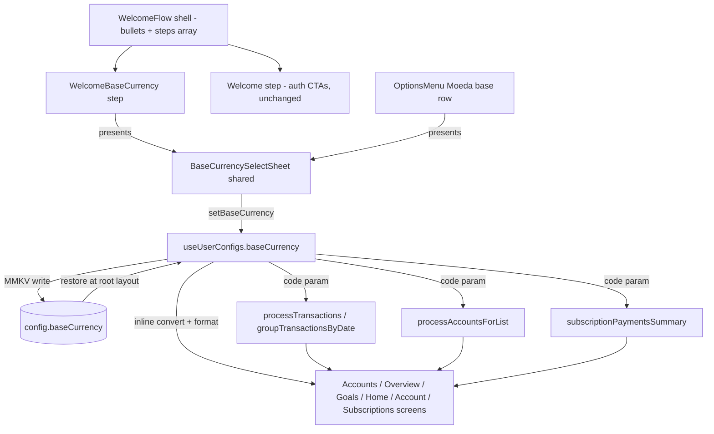

# Base Currency Design

**Spec**: `.specs/features/base-currency/spec.md`
**Status**: Draft

---

## Architecture Overview

A single base-currency value lives in the `useUserConfigs` zustand store, persisted client-only to MMKV (`config.baseCurrency`) and restored at app start. Two entry points feed the same store action through one shared selection sheet: the welcome flow's educational step (pre-auth) and a new `OptionsMenu` row (post-auth). Every app-wide aggregate converts and formats in the base currency by passing the store value explicitly into the existing pure utils; per-entity displays are untouched.



**Approaches considered:**

1. **Chosen: single-route step shell (`(auth)/index` renders `WelcomeFlow`)** — the flow is one route with an internal ordered steps array, bullets reflect the active index. Adding a screen = one array entry; no router changes; bullets can never desync from the route.
2. Route-per-step (expo-router Stack under `(auth)/welcome/*`) — rejected: bullets must be synced from route state across screens; more boilerplate per added step; no benefit at 2 steps.
3. Backend-persisted preference (`User.base_currency_id`) — rejected for this feature: selection happens pre-auth; requires a production-DB migration (explicit go-ahead needed); client-only precedent exists (`sortingOption`). Can be layered on later without UI changes (store stays the single source of truth for the UI).

---

## Code Reuse Analysis

### Existing Components to Leverage

| Component | Location | How to Use |
| --- | --- | --- |
| `CurrencySelect` | `src/screens/CurrencySelect/index.tsx` | The mandated selection UI. Gains an optional `items` prop to override the store list (base currency needs the filtered, quote-supported list); default behavior unchanged for `RegisterAccount`. |
| `ModalViewSelection` | `src/components/Modals/ModalViewSelection/index.tsx` | Hosts `CurrencySelect` in a bottom sheet — the exact `RegisterAccount` pattern (`snapPoints: ['75%']`, ref from host). |
| `SelectButton` | `src/components/SelectButton/index.tsx` | Trigger row in the welcome step and `OptionsMenu` (with `subTitle` showing the current base currency). |
| `ListItem` | `src/components/ListItem/index.tsx` | Currency rows (active check) — used inside `CurrencySelect`, unchanged. |
| `Button` / `Gradient` / `Screen` | `src/components/*` | Chrome for the flow shell and step content. |
| `formatCurrency` | `src/utils/formatCurrency.ts` | Unchanged, pure — receives the base code at call sites. |
| `convertCurrency` | `src/utils/convertCurrency.ts` | Unchanged — `toCurrency` receives the base code at call sites. |

### Integration Points

| System | Integration Method |
| --- | --- |
| MMKV `storageConfig` (`config` instance) | New key `baseCurrency` (JSON `CurrencyProps`), written inside the store action, read once at root layout restore |
| `useCurrenciesStore` + public `GET /currency` (runs at root layout incl. pre-auth) | Source of the selectable list; sheet filters to `CurrencyCodes` members |
| `useUserConfigs` consumers (`Accounts`, `Overview`, `Home`, `Account`, `Goals`, `Subscriptions`, `SubscriptionPayments`, `InstitutionDetails`, `AccountsList`, `TransactionsByCategory`, `BudgetDetails`) | Each reads `baseCurrency.code` and passes it into the pipeline / inline conversions |

---

## Components

### `src/utils/baseCurrency.ts` (new)

- **Purpose**: Pure base-currency domain helpers shared by store hydration, the sheet, and tests.
- **Interfaces**:
  - `DEFAULT_BASE_CURRENCY: CurrencyProps` — `{ id: 1, name: 'Brazilian Real', code: 'BRL', symbol: 'R$' }` (matches backend seed + existing test fixtures)
  - `SUPPORTED_BASE_CURRENCY_CODES: readonly CurrencyCodes[]` — `['BRL', 'BTC', 'EUR', 'USD']`
  - `isSupportedBaseCurrencyCode(code: unknown): code is CurrencyCodes`
  - `filterBaseCurrencyCandidates(currencies: CurrencyProps[]): CurrencyProps[]` — store list filtered by supported codes, order preserved
  - `parseStoredBaseCurrency(raw: string | undefined): CurrencyProps` — JSON.parse + shape + supported-code validation; any failure → `DEFAULT_BASE_CURRENCY`
- **Dependencies**: `CurrencyProps`/`CurrencyCodes` interfaces only.
- **Reuses**: nothing (new, pure, fully unit-testable).

### `useUserConfigs` extension (`src/stores/userConfigsStorage.ts`)

- **Purpose**: Single source of truth for the base currency in the UI tree.
- **Interfaces**:
  - `baseCurrency: CurrencyProps` — initial value `DEFAULT_BASE_CURRENCY`
  - `setBaseCurrency(currency: CurrencyProps): void` — `set(() => ({ baseCurrency }))` **and** `storageConfig.set(`${DATABASE_CONFIGS}.baseCurrency`, JSON.stringify(currency))` (persistence centralized in the action so all entry points persist identically)
- **Dependencies**: `@database/database` (new import — first store to persist inside its action; screens keep the read/write pattern for their own configs).
- **Reuses**: existing zustand store pattern; `sortingOption` restore pattern in `RootLayout`.

### `RootLayout` hydration (`src/app/_layout.tsx`)

- **Purpose**: Restore the persisted base currency once at app start, before `(app)` renders.
- **Interfaces**: `const storedBaseCurrency = storageConfig.getString(`${DATABASE_CONFIGS}.baseCurrency`); useUserConfigs.setState(() => ({ baseCurrency: parseStoredBaseCurrency(storedBaseCurrency) }));` — placed next to the existing `sortingOption` restore block.
- **Reuses**: the exact `savedSorting` restore pattern already in the file.

### `WelcomeFlow` (new screen shell — `src/screens/WelcomeFlow/`)

- **Purpose**: Extensible onboarding shell: bullets + active step + navigation.
- **Interfaces**:
  - `type WelcomeStepProps = { onNext?: () => void }` — shell hands the active step its advance callback (`undefined` on the last step)
  - `type WelcomeStep = { key: string; Component: ComponentType<WelcomeStepProps> }`
  - `WELCOME_STEPS: WelcomeStep[]` — `[{ key: 'base-currency', Component: WelcomeBaseCurrency }, { key: 'welcome', Component: Welcome }]` (exported for tests; future educational screens insert before the auth step)
  - `WelcomeFlow({ steps = WELCOME_STEPS }: { steps?: WelcomeStep[] })` — renders `Screen` + `Gradient` + `StepIndicator` + active step; `activeStep` state clamped to `steps.length - 1`
  - `StepIndicator({ count, active, onSelect }: { count: number; active: number; onSelect: (index: number) => void })` — tappable bullets (`accessibilityRole="button"`), active bullet themed by `theme.colors.primary`
- **Dependencies**: styled-components theme; step components.
- **Reuses**: `Screen`, `Gradient`, Welcome's existing styles.

### `Welcome` refit (step content — `src/screens/Welcome/index.tsx`)

- **Purpose**: Unchanged content, now a step: drops its own `Screen`/`Gradient` (the shell owns chrome) and accepts `WelcomeStepProps` (ignores `onNext` — terminal auth step).
- **Reuses**: its own `Container`/`Logo`/`Title`/`Text` styles, Login/Criar conta handlers — untouched.

### `WelcomeBaseCurrency` (new step — `src/screens/WelcomeBaseCurrency/`)

- **Purpose**: Educational step: informs a default currency can be set, shows the current selection, opens the shared sheet, offers "Continuar".
- **Interfaces**:
  - `WelcomeBaseCurrency({ onNext }: WelcomeStepProps)`
  - Owns a `BottomSheetModal` ref; renders `SelectButton` (title "Moeda base", `subTitle` = current `baseCurrency.name`, `CoinsIcon`) presenting the shared sheet; "Continuar" button calls `onNext?.()`
- **Dependencies**: `useUserConfigs` (read current), `BaseCurrencySelectSheet`, `useCurrenciesStore`.
- **Reuses**: `RegisterAccount`'s bottom-sheet ref pattern; `SelectButton`; `Button`.

### `BaseCurrencySelectSheet` (new shared component — `src/components/BaseCurrencySelectSheet/`)

- **Purpose**: One selection flow for both entry points (BC-06): sheet + wiring to the store.
- **Interfaces**:
  - `BaseCurrencySelectSheet({ bottomSheetRef }: { bottomSheetRef: RefObject<BottomSheetModal> })`
  - Renders `ModalViewSelection` (title "Selecione a moeda base", `snapPoints: ['75%']`) hosting `CurrencySelect` with `currency={baseCurrency}`, `setCurrency={setBaseCurrency}`, `closeSelectCurrency={() => bottomSheetRef.current?.dismiss()}`, `items={filterBaseCurrencyCandidates(currencies)}`
- **Dependencies**: `useUserConfigs`, `useCurrenciesStore`, `ModalViewSelection`, `CurrencySelect`.
- **Reuses**: the full `RegisterAccount` modal wiring, with the store instead of local state.

### `CurrencySelect` extension (`src/screens/CurrencySelect/index.tsx`)

- **Interfaces**: optional `items?: CurrencyProps[]` — `const currencies = items ?? useCurrenciesStore((state) => state.currencies)`. Default path identical (BC for `RegisterAccount` unchanged).
- **Reuses**: everything else unchanged.

### `OptionsMenu` entry (`src/screens/OptionsMenu/index.tsx`)

- **Interfaces**: new `SelectButton` in the Configurações section — icon `CoinsIcon`, title "Moeda base", `subTitle={baseCurrency.name}`, `onPress` presents the sheet (own `BottomSheetModal` ref + `BaseCurrencySelectSheet`).
- **Reuses**: `RegisterAccount` sheet pattern; existing SelectButton section layout.

### Pipeline utils (parameter additions, defaults preserve current behavior)

| File | Change |
| --- | --- |
| `src/utils/groupTransactionsByDate.ts` | `(transactions, baseCurrencyCode: CurrencyCodes = 'BRL')`; groups gain `rawTotal: number`; `total` formatted via `formatCurrency(baseCurrencyCode, rawTotal)` instead of inline `toLocaleString` BRL |
| `src/utils/processTransactions.ts` | 4th param `baseCurrencyCode: CurrencyCodes = 'BRL'`; sums `rawTotal` for the period (replaces the "R$…"-string re-parse); result gains `currentCashFlowValue: number`; `currentCashFlow` formatted with the base code |
| `src/utils/processAccountsForList.ts` | 3rd param `baseCurrencyCode: CurrencyCodes = 'BRL'`; conversion `toCurrency: baseCurrencyCode`; `totalAccountAmountConverted` formatted in base; `balanceConvertedToBRL` renamed `balanceConvertedToBase` |
| `src/utils/subscriptionPaymentsSummary.ts` | `convertAmountToBRL` → `convertAmountToBase(amount, currencyCode, quotes, baseCurrencyCode: CurrencyCodes = 'BRL')`; `getUpcomingPaymentsSummary`/`computePaymentsTotal` gain trailing `baseCurrencyCode` param (default 'BRL') |

### Screens (read `baseCurrency.code` from `useUserConfigs`, pass into pipeline / inline conversions)

| Screen | Change |
| --- | --- |
| `Home` | `processTransactions(..., baseCurrency.code)`; loading fallback `formatCurrency(baseCurrency.code, 0)`; memo deps |
| `Account` | Same as Home; `isCashFlowPositive` from `currentCashFlowValue` (drops the string re-parse); loading fallback in base |
| `TransactionsByCategory`, `BudgetDetails` | `processTransactions(..., baseCurrency.code)`; memo deps |
| `Accounts`, `InstitutionDetails` | All inline `convertCurrency({toCurrency: baseCurrency.code})`; `totalBalanceFormatted`, institution `totalFormatted`, loading fallbacks, and the secondary converted line (shown when `account.currency.code !== baseCurrency.code`) formatted in base; `accountBalanceConvertedToBRL` → `accountBalanceConvertedToBase`; memo deps |
| `AccountsList` | `processAccountsForList(accounts, quotes, baseCurrency.code)`; memo deps |
| `Overview` | `convertedBalance` conversion target base; `totalFormatted`, Patrimônio/Fluxo/Despesas/Receitas buttons in base; memo deps |
| `Goals` | `totalSavedFormatted`: fast-path `goal.currency.code === baseCurrency.code`, else convert `toCurrency: baseCurrency.code`; format in base; memo deps |
| `Subscriptions` | `getUpcomingPaymentsSummary(..., baseCurrency.code)` + format in base |
| `SubscriptionPayments` | `computePaymentsTotal(..., baseCurrency.code)` + format in base |

---

## Data Models

```typescript
// Persisted shape (MMKV `config.baseCurrency`) — identical to CurrencyProps
interface StoredBaseCurrency {
  id: number;        // must be a number (validated)
  name: string;      // must be a non-empty string (validated)
  code: CurrencyCodes; // must be in SUPPORTED_BASE_CURRENCY_CODES (validated)
  symbol: string;
}

// Welcome flow
type WelcomeStepProps = { onNext?: () => void };
type WelcomeStep = { key: string; Component: ComponentType<WelcomeStepProps> };

// groupTransactionsByDate output gains a numeric sibling to the formatted string
interface GroupedTransactionProps {
  title: string;
  total: string;      // formatted in base currency
  rawTotal: number;   // exact numeric total (no string parsing)
  data: TransactionProps[];
}
```

**Relationships**: the persisted object is a `CurrencyProps` from the public `GET /currency` list; the store also accepts any validated restore of it.

---

## Error Handling Strategy

| Error Scenario | Handling | User Impact |
| --- | --- | --- |
| Corrupt / missing / unsupported `config.baseCurrency` at startup | `parseStoredBaseCurrency` falls back to `DEFAULT_BASE_CURRENCY` (BC-04) | Totals display in BRL — same as a fresh install |
| Currencies query not yet resolved when the sheet opens | Sheet renders an empty FlatList (same as `RegisterAccount` today) | Selection available as soon as the store fills; no crash |
| Unsupported quote pair during an aggregation | Existing per-site `try/catch` skip behavior preserved (BC-20) | Item excluded from totals, no crash |
| User reselects the active base currency | Idempotent store write + sheet dismiss | No-op, sheet closes |

---

## Risks & Concerns

| Concern | Location (file:line) | Impact | Mitigation |
| --- | --- | --- | --- |
| `processTransactions` re-parses formatted "R$ 1.234,56" day totals (drops cents; breaks outright for "US$ …": yields NaN) | `src/utils/processTransactions.ts:210-214` | Wrong cash flow once base ≠ BRL; already lossy for BRL | Root-cause fix in this feature: `rawTotal`/`currentCashFlowValue` (BC-19) |
| `Account` re-parses the formatted cash flow for its sign | `src/screens/Account/index.tsx:212-214` | Wrong sign/color for US$/€ totals | Uses `currentCashFlowValue` (BC-19) |
| Screen-level jest tests are env-blocked for phosphor ESM (pre-existing `profile.spec.tsx` failure) | `package.json` jest config (`preset: jest-expo`, default `transformIgnorePatterns` lacks `phosphor-react-native`) | Cannot render-step-test trees that use phosphor icons | Extend `transformIgnorePatterns` with the preset's three entries + `phosphor-react-native` (task 3); full-suite gate confirms no regressions. `OptionsMenu` render test stays out of scope (clerk/onesignal-heavy tree) — wiring verified statically + tsc |
| Per-entity fields named `…ConvertedToBRL` while semantics become base-normalized | `src/screens/Accounts/index.tsx:155`, `src/utils/processAccountsForList.ts` | Misleading names | Rename to `…ConvertedToBase` in touched call sites (type-checked) |
| Net-worth series and day totals mix account currencies before summing (pre-existing) | `src/utils/buildNetWorthEvolution.ts:86-97`, `groupTransactionsByDate.ts:9-22` | Aggregates are approximations regardless of display currency | Explicitly out of scope (spec); arithmetic unchanged, only display currency + raw values |
| `storageConfig.set(`${DATABASE_CONFIGS}`, '')` on sign-out does not clear `config.baseCurrency` | `src/providers/AuthProvider.tsx:307-317` | Base currency persists across sign-out | Intended (client-only preference, like `sortingOption`) — BC-03 edge case |

---

## Tech Decisions (only non-obvious ones)

| Decision | Choice | Rationale |
| --- | --- | --- |
| Where the base currency persists | Client-only MMKV; no backend field | Pre-auth selection in welcome flow; `sortingOption` precedent; backend needs a production migration (explicit go-ahead). Recorded as AD-002 in STATE.md. |
| Welcome step order | Education step first, `Welcome` (auth) last | Flow must terminate in auth; onboarding-before-auth is the cited common practice. Recorded as AD-003 in STATE.md. |
| Utils keep `baseCurrencyCode = 'BRL'` defaults | Optional param with default | Keeps existing call sites + 267 tests valid during transition; screens pass the store value explicitly (no silent default in prod paths — verified in tasks) |
| `formatCurrency` stays pure | Code passed at call sites | Codebase convention (pure utils, injected stores); a store-reading formatter would break the pure test suite and hide the dependency |
| Base currency candidates restricted to `CurrencyCodes` | Filter in `BaseCurrencySelectSheet` via `filterBaseCurrencyCandidates` | Quotes matrix + formatter only support BRL/BTC/EUR/USD; ETH/USDC/USDT would throw on conversion |
| Store action owns the MMKV write | `setBaseCurrency` persists internally | Three write sites (welcome, options, future) cannot drift; mirrors "stores persist manually, no middleware" convention |

> **Project-level decisions:** AD-002 (client-only base-currency persistence) and AD-003 (welcome flow order/step shell) appended to `.specs/STATE.md` `## Decisions`.
