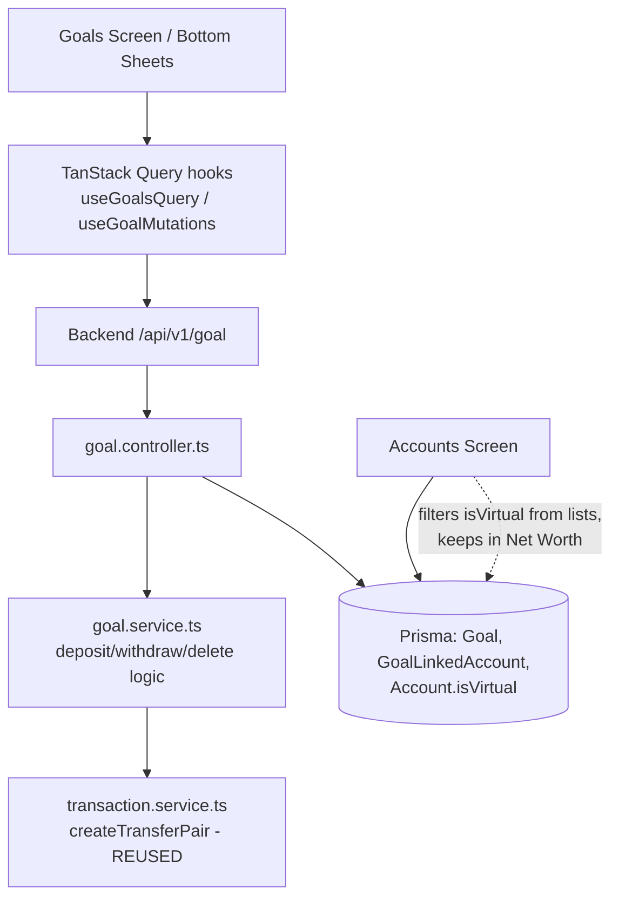

# Financial Goals / Savings Targets Design

**Spec**: `.specs/features/financial-goals/spec.md`
**Context**: `.specs/features/financial-goals/context.md`
**Status**: Draft

---

## Architecture Overview

Approach A (confirmed): a goal's virtual reserve is a genuine row in the `Account` table, flagged with a new `isVirtual` column and owned 1:1 by a `Goal`. All money movement reuses the existing two-leg transfer machinery (`createTransferPair`), so balances, cash flow, and net worth stay correct by construction. New server-side `goal` module in `smart-finances-backend`; new Goals stack under the options tab in the app.



**Deposit flow:** `RegisterGoalMovement` sheet → `useGoalDepositMutation` → `POST /goal/:id/deposit` → `goal.service` validates (goal ACTIVE, amount > 0, source owned & not virtual) → `createTransferPair` (debit source / credit reserve) → invalidate `['goals','goal',id,'accounts','transactions']`.

**Delete flow:** `DELETE /goal/:id` (+ optional `destination_account_id`) → server transfers reserve balance back if > 0 → deletes Goal row (junction cascades) → deletes reserve Account row (its legs cascade; counterpart legs unlinked via existing `SetNull` on `relatedTransactionId`; real-account balances untouched since reserve ends at 0).

---

## Code Reuse Analysis

### Existing Components to Leverage

| Component | Location | How to Use |
| --- | --- | --- |
| Transfer pair creation | `backend/src/services/transaction.service.ts` (`createTransferPair`) | Called by `goal.service` for deposit/withdraw/transfer-back — unchanged |
| Transfer zod conventions | `backend/src/schemas/transaction.schema.ts` | Mirror snake_case coercion style in `goal.schema.ts` |
| Budget module layering | `backend/src/{routes,controllers,schemas}/budget.*` | Template for goal module files |
| Register/edit bottom-sheet flow | `src/screens/RegisterBudget`, `ModalView`, `ModalViewSelection` | Template for `RegisterGoal` + account multi-select |
| Progress bar | `src/components/BudgetListItem/components/BudgetPercentBar` | Visual template for `GoalListItem` progress bar |
| Currency conversion | `src/utils/convertCurrency.ts` + `useQuotes` | Convert linked/reserve balances into goal currency |
| Options stack | `src/app/(app)/options/_layout.tsx` | Hosts the new `goals/` nested stack |
| Default category fallback | `provisionNewUser` seeds "Sem categoria" | Server fallback category for goal transfer legs |
| Multi-select store pattern | `src/stores/budgetCategoriesSelected.ts` | Template for `goalAccountsSelected` store |

### Integration Points

| System | Integration Method |
| --- | --- |
| `GET /account` | Returns virtual accounts too (no server filter); frontend filters `isVirtual` from all list/picker UIs, keeps them in net worth |
| Accounts screen total | Already sums all non-hidden accounts → virtual reserves included automatically (GOAL-25) |
| Net worth evolution | `buildNetWorthEvolution` works off transactions; transfer legs net to zero → unchanged (GOAL-27) |
| Account deletion | `GoalLinkedAccount` FK `onDelete: Cascade` auto-unlinks (GOAL-41); `deleteAccount` gains an `isVirtual` guard (GOAL-42) |
| OptionsMenu | New `SelectButton` "Metas & Objetivos" with `Target` icon → `/options/goals` |

---

## Components (Backend — `/Users/vap/00_code/JS/smart-finances-backend`)

### `prisma/schema.prisma` additions

```prisma
enum GoalStatus {
  ACTIVE
  COMPLETED
  ARCHIVED
  @@map("goal_status")
}

model Goal {
  id               String    @id @default(uuid())
  name             String
  targetAmount     Decimal   @map("target_amount") @db.Decimal(20, 8)
  currencyId       Int       @map("currency_id")
  deadline         DateTime?
  status           GoalStatus @default(ACTIVE)
  previousStatus   GoalStatus? @map("previous_status") // set on archive, consumed on unarchive
  completedAt      DateTime? @map("completed_at")
  userId           String    @map("user_id")
  reserveAccountId Int?      @unique @map("reserve_account_id") // null when the goal has linked accounts (amended 2026-08-27)
  createdAt/updatedAt

  user           User               @relation(..., onDelete: Cascade)
  currency       Currency           @relation(...)
  reserveAccount Account?           @relation("GoalReserve", fields: [reserveAccountId], references: [id])
  linkedAccounts GoalLinkedAccount[]
  @@map("goals")
}

model GoalLinkedAccount {
  goalId    String @map("goal_id")
  accountId Int    @map("account_id")
  goal      Goal    @relation(fields: [goalId], references: [id], onDelete: Cascade)
  account   Account @relation(fields: [accountId], references: [id], onDelete: Cascade)
  @@id([goalId, accountId])
  @@map("goal_linked_accounts")
}

// on Account:
isVirtual     Boolean @default(false) @map("is_virtual")
goalReserve   Goal?   @relation("GoalReserve")
```

**Relationships**: `Goal` 1:0..1 `Account` (reserve, optional since 2026-08-27 amendment); `Goal` N:M `Account` via junction (linked). Junction cascades cover both goal deletion and linked-account deletion (GOAL-41). Invariant: every goal has ≥1 money target — a reserve, or ≥1 linked account (edit re-creates the reserve when the last link is removed, GOAL-45).

### `src/routes/goal.routes.ts`
Per-route `authenticate` + `validate` + `asyncHandler`, registered in `server.ts` as `app.use(`${API_PREFIX}/goal`, goalRoutes)`. Endpoints:

| Method | Path | Purpose |
| --- | --- | --- |
| GET | `/goal` | List goals (+ reserve account, currency, linked accounts) — all statuses, client filters |
| GET | `/goal/:id` | Goal detail (+ reserve account transactions, newest first) |
| POST | `/goal` | Create goal + links atomically; reserve account created only when no accounts linked (GOAL-43/44) |
| PATCH | `/goal/:id` | Edit name/target/deadline/linked accounts (ACTIVE only; currency immutable); emptying links on a reserve-less goal re-creates the reserve (GOAL-45) |
| PATCH | `/goal/:id/status` | `{ action: conclude \| archive \| unarchive }` with transition guards |
| POST | `/goal/:id/deposit` | `{ amount, source_account_id, linked_account_id?, amount_in_account_currency?, category_id?, description?, transaction_date? }` — `linked_account_id` picks the linked target when no reserve exists (GOAL-46/48) |
| POST | `/goal/:id/withdraw` | `{ amount, destination_account_id, linked_account_id?, ... }` — `linked_account_id` picks the linked source when no reserve exists (GOAL-47/48) |
| DELETE | `/goal/:id` | `destination_account_id` required only when a reserve exists AND its balance > 0 |

### `GET /account` virtual filtering (amendment 2026-08-27, GOAL-49/50)

- Default: `where: { userId, isVirtual: false }` — virtual reserves never reach default consumers (lists, pickers).
- `?include_virtual=true`: returns all accounts; the formatter ALWAYS exposes `isVirtual` on every account (the omission of this field was the root cause of the Accounts-screen leak found in UAT).
- Frontend: `useAccountsQuery(includeVirtual?)` — `queryKey ['accounts']` vs `['accounts', 'include-virtual']` (prefix invalidation on `['accounts']` still covers both). Only the Accounts screen (net worth) passes `true`; its list/grouping filters keep excluding `isVirtual` client-side while totals include them.

### `src/schemas/goal.schema.ts`
Zod v4 schemas mirroring transaction/budget style: `createGoalSchema` (name min 1, `target_amount` positive, `currency_id` coerced int, `deadline` iso datetime optional, `linked_account_ids` int array optional), `updateGoalSchema`, `goalIdParamSchema`, `goalStatusSchema`, `goalDepositSchema`/`goalWithdrawSchema` (amount positive), `deleteGoalSchema` (optional `destination_account_id`).

### `src/controllers/goal.controller.ts`
Hand-formatted snake_case DTOs (`target_amount: goal.targetAmount.toString()`, etc.); `AppError` + logger + rethrow pattern from `transaction.controller.ts` (NOT the older account.controller 401 style).

### `src/services/goal.service.ts` (amended 2026-08-27)
Pure, testable functions taking `Prisma.TransactionClient`:
- `createGoalWithReserve(tx, userId, data)` — creates `Goal` + junction rows; creates the reserve `Account` (`isVirtual: true`, type `OTHER`, name `Reserva: {goalName}`) ONLY when `linkedAccountIds` is empty (GOAL-43/44).
- `ensureGoalReserve(tx, goal)` — helper: creates an empty reserve for a reserve-less goal (used by edit when the last link is removed, GOAL-45).
- `depositToGoal(tx, goal, data)` — guards (ACTIVE, amount > 0, source owned & `!isVirtual`), resolves category. Target: `data.linkedAccountId` when provided (must be linked to the goal, else 400 — GOAL-48) or the reserve when present; a reserve-less goal without `linkedAccountId` is a 400.
- `withdrawFromGoal(tx, goal, data)` — same guards + `amount <=` chosen source balance (reserve, or the chosen linked account — Decimal comparison, GOAL-14).
- `deleteGoalWithTransferBack(tx, goal, destinationAccountId?)` — transfer-back pair only when a reserve exists AND balance > 0; then delete goal (+ reserve account when present). No-reserve goals skip the transfer-back (GOAL-36).
- `transitionGoalStatus(goal, action)` — state machine: conclude (ACTIVE→COMPLETED, sets `completedAt`), archive (ACTIVE|COMPLETED→ARCHIVED, stores `previousStatus`), unarchive (ARCHIVED→`previousStatus ?? ACTIVE`, clears it); invalid → `AppError(400)`.
- `resolveGoalTransferCategory(tx, userId, categoryId?)` — provided id → validate ownership; else user's "Sem categoria"; else first category; none → `AppError(400)`.

### `account.controller.ts` changes
- `deleteAccount`: reject with `AppError(400)` when `account.isVirtual` ("Conta virtual de meta — exclua pela tela da meta").
- `getAccounts`: `isVirtual: false` filter by default, `?include_virtual=true` opt-in, `isVirtual` always present in the formatted DTO (GOAL-49/50).

---

## Components (Frontend — `/Users/vap/00_code/JS/SmartFinances`)

### Routing — `src/app/(app)/options/goals/`
- `_layout.tsx` — Stack mirroring `budgets/_layout.tsx` (`headerShown: false`, pt-BR titles): `index`, `[goalId]`, `completed`, `archived`.
- `index.tsx` → `@screens/Goals`; `[goalId].tsx` → `@screens/GoalDetails`; `completed.tsx` → `@screens/CompletedGoals`; `archived.tsx` → `@screens/ArchivedGoals`.
- `src/screens/OptionsMenu/index.tsx` — new `SelectButton` ("Metas & Objetivos", `Target` icon from phosphor-react-native) under "Conta" section → `router.navigate('/options/goals')`.

### Screens (`src/screens/`)
| Screen | Purpose | Reuses |
| --- | --- | --- |
| `Goals/index.tsx` | Active goals: summary card, FlashList of `GoalListItem`, FAB, header icons to Completed/Archived | `Screen`, `Header`, `Gradient`, `ModalView`, skeleton pattern |
| `GoalDetails/index.tsx` | Progress header, evolution/projection chart (amendment 2026-09-08), linked accounts list, history (reserve transfer legs), Deposit/Withdraw CTAs, header menu: edit/conclude/archive/delete | `Header.Icon`, `ModalView`, `GoalProjectionChart` |
| `RegisterGoal/index.tsx` | Create/edit form in bottom sheet: name, amount (`CurrencyInput` pattern), currency, optional deadline, account multi-select | react-hook-form + yup, `ModalViewSelection`, `goalAccountsSelected` store |
| `RegisterGoalMovement/index.tsx` | One parameterized sheet (`type: 'deposit' \| 'withdraw'`): amount, source/destination account picker (non-virtual only), validation incl. over-balance | `AccountDestinationSelect` pattern |
| `CompletedGoals/index.tsx` | Completed list w/ completion date + empty state | list pattern |
| `ArchivedGoals/index.tsx` | Archived list w/ unarchive action + empty state | list pattern |

### Components
- `src/components/GoalListItem/index.tsx` (+`styles.ts`) — card: name, current/target formatted, progress bar (modeled on `BudgetPercentBar`), deadline, "Meta atingida" badge.
- `src/screens/GoalDetails/components/GoalProjectionChart/index.tsx` (+`styles.ts`) — evolution/projection line chart (amendment 2026-09-08), modeled on `BudgetDetails/components/BudgetHistoryChart`.

### Hooks (`src/hooks/`)
- `useGoalsQuery.ts` — `queryKey: ['goals']`, `GET goal`.
- `useGoalDetailQuery.ts` — `queryKey: ['goal', goalID]`, `GET goal/{id}`.
- `useGoalMutations.ts` — create/update/delete/status; optimistic per CONVENTIONS.md; invalidate `['goals']`.
- `useGoalMovementMutations.ts` — deposit/withdraw; on success invalidate `['goals']`, `['goal', id]`, `['accounts']`, `['transactions']`; CTA disabled via `isPending` (GOAL-15).

### Interfaces & stores & utils
- `src/interfaces/goals.ts` — `GoalProps { id, name, target_amount, currency, deadline?, status, completed_at?, reserve_account: ReserveAccountProps | null, linked_accounts: LinkedAccountProps[] }`; `GoalStatus = 'ACTIVE' | 'COMPLETED' | 'ARCHIVED'`.
- `src/interfaces/accounts.ts` — add `isVirtual?: boolean` to `AccountProps`.
- `src/stores/goalAccountsSelected.ts` — mirror `budgetCategoriesSelected`.
- `src/utils/goalCalculations.ts` — `computeGoalProgress(goal, quotes)`: `((reserve?.balance ?? 0) + Σ linked balances converted to goal currency) / target`, returns `{ currentAmount, percentage, isAmountReached }`; pure + unit-testable; null-reserve safe.
- `src/utils/buildGoalProjection.ts` — (amendment 2026-09-08) `buildGoalProjection(goal)`: monthly cumulative buckets from `goal.transactions` + projection points; pure + unit-testable. See "Evolution & projection chart (amendment 2026-09-08, GOAL-51/52/53)" below.

### Evolution & projection chart (amendment 2026-09-08, GOAL-51/52/53)

Decisions (recorded with the spec amendment):

- **D1 — Data source.** History derives from the goal detail's `transactions` (movement legs already returned newest-first in goal currency, reserve + linked accounts per the 2026-08-27 history amendment). Legs on the goal side are signed by type: `TRANSFER_CREDIT` adds, `TRANSFER_DEBIT` subtracts. Each calendar month between the first movement month and the current month (inclusive) gets one cumulative point; months without movements repeat the previous cumulative value.
- **D2 — Average & projection.** Average monthly progress = (last cumulative − first cumulative) / (elapsed months − 1). The projection extends one point per month at that average until the target amount is reached; it is capped at 60 future months and only exists when the average is > 0.
- **D3 — Library mechanics (corrected 2026-09-08 after dist verification of `react-native-gifted-charts` 1.4.7).** One `LineChart`. The solid history is `data`; the dashed projection is the native second dataset `data2` — null values over the history indices, the last real cumulative repeated at the connect index, then one projected value per future month — styled with `strokeDashArray2` and the placeholder color. `interpolateMissingValues` must be passed as `false` explicitly (the installed dist defaults it to `true`, unlike earlier docs): with it false, `getLineSegmentsForMissingValues` emits transparent segments for non-numeric values, so `data2` draws only from the connect index onward. The final projection point carries a native arrowhead via `showArrow2` + `arrowConfig2` (present in 1.4.7 — no fallback needed).
- **D4 — Guards.** The chart renders only with ≥ 2 distinct movement months; the projection only with average > 0. Y-axis top reference is the target amount (the "100%" line of the mockup); labels in compact "k" form (parity with Home/Accounts).
- **D5 — Placement & masking.** Directly below the progress `HeaderCard`, above "Contas vinculadas"; existing layout untouched. `hideAmount` masks data-point/focus texts ("•••••"), same as every other amount on the screen.

### Visibility filtering (GOAL-24/26, amended 2026-08-27)
Server-side default exclusion on `GET /account` is the primary mechanism (GOAL-49/50); the Accounts screen fetches with `include_virtual=true` (net worth must include reserves, GOAL-25) and keeps its client-side `!isVirtual` filters for list/grouping render paths only. `AccountsList`, pickers, and Home filters use the default (already-excluded) response — their client filters remain as harmless defense-in-depth.

---

## Data Models

### API DTO (snake_case, mirrors budget style)

```typescript
// GET /goal response item
{
  id: string; name: string; target_amount: string; status: 'ACTIVE'|'COMPLETED'|'ARCHIVED';
  deadline: string | null; completed_at: string | null;
  currency: { id: number; code: string; symbol: string };
  reserve_account: { id: number; name: string; balance: number; is_virtual: true; currency_id: number } | null;
  linked_accounts: { id: number; name: string; balance: number; currency: {...}; type: string }[];
  created_at: string; updated_at: string;
}
```

**Relationships**: Goal 1:0..1 reserve Account; Goal N:M real Accounts; reserve (or linked accounts' goal-tagged transfer legs) = goal history.

---

## Error Handling Strategy

| Error Scenario | Handling | User Impact |
| --- | --- | --- |
| API failure on any mutation | Optimistic rollback + `Alert.alert` (CONVENTIONS pattern) | pt-BR error alert, state restored |
| Withdraw > chosen source balance | Server `AppError(400)`; client pre-validates and shows field error | "Saldo insuficiente" |
| Deposit/withdraw naming a non-linked account | Server `AppError(400)` (GOAL-48) | Error alert |
| Delete with balance, no destination picked | Client blocks CTA until account picked; server `AppError(400)` as backstop | Form hint |
| Transfer-back failure during delete | Entire delete runs in one `$transaction` → rollback | Goal intact + error alert |
| Invalid status transition (e.g. conclude ARCHIVED) | `AppError(400)` from state machine | Error alert |
| Deposit/withdraw on COMPLETED/ARCHIVED goal | Server `AppError(400)`; CTAs hidden client-side | CTAs absent |
| User deleted "Sem categoria" | Fallback to first user category; none → `AppError(400)` | Transparent |

---

## Risks & Concerns

| Concern | Location | Impact | Mitigation |
| --- | --- | --- | --- |
| Account pickers/list renderers scattered — easy to miss one and leak a virtual account into UI | `src/screens/Accounts/index.tsx`, `AccountsList`, `RegisterTransaction`, Home filters | GOAL-24/26 violation | Dedicated audit task (grep every `accounts.map`/`.filter`) + Verifier spec-check on GOAL-24/26 |
| Accounts total sums ALL non-hidden accounts | `src/screens/Accounts/index.tsx:135-137` | Correct for goals, but any future non-goal virtual account would join the total | `isVirtual` documented as goal-reserve-only in STATE.md decision AD-001 |
| `GET /account` has no server-side filter; older app versions would render virtual accounts | `backend/src/controllers/account.controller.ts` | Users on stale app versions see "Reserva: X" accounts | **Resolved 2026-08-27**: server now default-excludes virtual accounts (GOAL-49); stale clients never receive them |
| `getAccounts` formatter omitted `isVirtual` from the DTO (found in UAT: reserve rendered on the Accounts screen despite client filters) | `account.controller.ts` `formattedAccounts` | Every client `!isVirtual` filter was dead code | Formatter always exposes `isVirtual` (GOAL-50); backend default-exclusion is now the primary mechanism |
| `categoryId` is required on transfer legs but goals UX has no category picker | `transaction.service.ts:126-132` | Deposits would 400 without a category | `resolveGoalTransferCategory` fallback chain |
| `deleteAccount` catches and responds 401 for all errors | `account.controller.ts:598-601` | `isVirtual` guard error would surface as 401 | Keep guard inside try; frontend treats failure generically; flag as pre-existing tech debt (not in scope to refactor) |
| Decimal `Decimal(20,8)` balance comparisons in JS | withdraw guard | Float rounding could allow 1-cent over-withdrawal | Compare via Prisma `Decimal` (`new Decimal(a).greaterThan(b)`) in `goal.service` |
| Test coverage: goal module is new | `backend/src/__tests__/` | Regressions undetected | `goal.service.test.ts` + `goal.schema.test.ts` mirroring existing test style; tasks derive tests from spec ACs |

---

## Tech Decisions (only non-obvious ones)

| Decision | Choice | Rationale |
| --- | --- | --- |
| Virtual account discriminator | `Account.isVirtual Boolean @default(false)` | New `AccountType` enum value would ripple through every type switch/icon mapping; boolean is invisible to existing code |
| Reserve account `type` | `OTHER` | Neutral; never rendered in typed UIs anyway |
| Delete mechanics | Transfer-back to zero, then delete Goal + reserve Account rows (leg cascade + SetNull unlink) | No balance-reversal math needed (reserve ends at 0); real-account history preserved; net worth unchanged (GOAL-36/39) |
| Deposit/withdraw endpoints | Dedicated `/goal/:id/deposit|withdraw` wrapping `createTransferPair` | Server-side guards (status, bounds, ownership) impossible to enforce via generic `POST /transaction` |
| Goal currency | Immutable after creation | Reserve account currency would have to change too; editing target/name/deadline covers the spec |
| Progress computation | Client-side (`computeGoalProgress` + quotes), server returns raw balances | Consistent with budgets and net worth (both client-computed) |
| Status transitions | Single `PATCH /goal/:id/status` with action enum + `previousStatus` column | Unarchive-restore (GOAL-33) needs the memory column; one endpoint keeps guards centralized |
| Entry point placement | Nested `options/goals/` stack (not a tab) | Spec: entry via OptionsMenu only |
| Reserve existence (amended 2026-08-27) | Reserve created only when no accounts linked (`reserveAccountId` nullable); deposits/withdrawals route to a chosen linked account when no reserve exists | User decision: redundant reserves for linked goals; direct-to-linked routing |
| Virtual exposure on `GET /account` (2026-08-27) | Default-exclude + `include_virtual=true` opt-in + always expose `isVirtual` in DTO | Client-side-only filtering already failed once; safe-by-default on the server |

> Project-level decisions appended to `.specs/STATE.md` (AD-001, AD-002).
