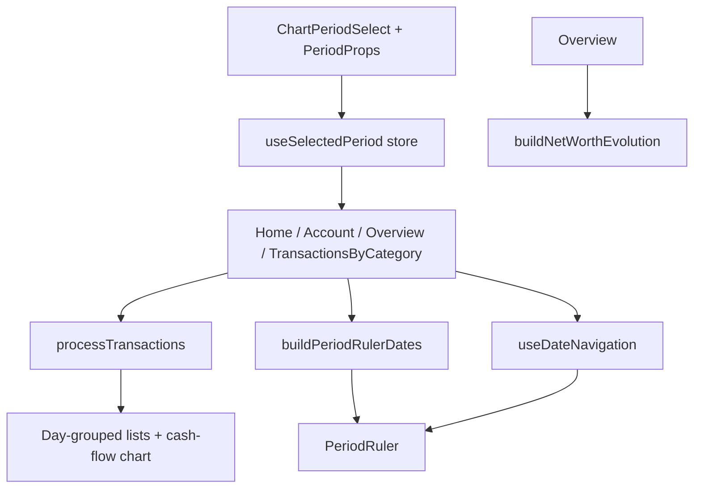

# Weekly Period Filter Design

**Spec**: `.specs/features/weekly-period-filter/spec.md`
**Context**: `.specs/features/weekly-period-filter/context.md`
**Status**: Approved

---

## Architecture Overview

**Approach: Consolidate + extend** (approved via spec assumption — executes the follow-up blessed by STATE.md decision #32). Week logic is added once to the shared period modules, and the two remaining inline copies (Home `PeriodRulerList`, Account `_renderPeriodRuler`/`handleDateChange`) are migrated to the shared implementations, so a single source of truth owns period behavior.

Alternatives considered: extend all five inline copies in place (rejected — cements triplication, violates DRY); full period-logic module refactor (rejected — regression risk beyond feature need).



All period semantics (ISO week grouping key, `Sem N \n YYYY` label, ±1-week step, week-end tap anchor) live in the shared utils/hook; screens only pass `selectedPeriod.period` through.

---

## Code Reuse Analysis

### Existing Components to Leverage

| Component | Location | How to Use |
| --- | --- | --- |
| `buildPeriodRulerDates` | `src/utils/buildPeriodRulerDates.ts` | Extend with `weeks` branch; becomes the single ruler-dates source for all screens |
| `useDateNavigation` | `src/hooks/useDateNavigation.ts` | Extend with `weeks` navigation/parsing; adopted by Account |
| `processTransactions` | `src/utils/processTransactions.ts` | Extend `periodConfig` + `isInSelectedPeriod` with `weeks` |
| `buildNetWorthEvolution` | `src/utils/buildNetWorthEvolution.ts` | Extend `periodConfig` with `weeks` |
| `PeriodRuler` | `src/components/PeriodRuler/index.tsx` | Unchanged — consumes `{date, isActive}[]` |
| `date-fns` ISO helpers | `getISOWeek`, `getISOWeekYear`, `getISOWeeksInYear`, `endOfISOWeek`, `startOfDay`, `addWeeks`, `subWeeks` | Verified against installed v2.22.1 (parse/format of `'Sem' I R` and `R-II` round-trip correctly; 2026 = 53 ISO weeks) |

### Integration Points

| System | Integration Method |
| --- | --- |
| `useSelectedPeriod` store | `PeriodProps.period` union gains `'weeks'`; picker option added; in-memory only (no MMKV persistence of the period) |
| `PeriodProps` type | Single union type consumed by store, hook, utils, screens — extending it gives compile-time exhaustiveness everywhere |

---

## Components

### 1. `ChartPeriodSelect` — picker option + type

- **Purpose**: Render the period options and own the `PeriodProps` contract.
- **Location**: `src/screens/ChartPeriodSelect/index.tsx`
- **Changes**:
  - `PeriodProps.period` → `'weeks' | 'months' | 'years' | 'all'`
  - `periods` array gains `{ id: '1', name: 'Semanas', period: 'weeks' }` first; existing options renumbered `2/3/4` (ids are opaque, in-memory only — nothing persists them)
- **Reuses**: existing `ListItem` rendering, `useSelectedPeriod` setter

### 2. `selectedPeriodStorage` — default id alignment

- **Purpose**: Zustand store for the globally selected period/date.
- **Location**: `src/stores/selectedPeriodStorage.ts`
- **Changes**: default `selectedPeriod` id `'1'` → `'2'` (Meses keeps its meaning after renumbering). No other change.

### 3. `processTransactions` — weeks grouping & filtering

- **Purpose**: Group transactions into cash-flow chart bars, filter by selected period, group by day.
- **Location**: `src/utils/processTransactions.ts`
- **Changes**:
  - `PeriodType` gains `'weeks'`
  - `periodConfig.weeks`: `groupKey: (date) => format(date, 'R-II')` (ISO week-year + zero-padded ISO week, lexicographically sortable), `outputFormat: "'Sem' I '\n' R"`, `parseFormat: 'R-II'`
  - `isInSelectedPeriod` gains `case 'weeks'`: `getISOWeek(date) === getISOWeek(selectedDate) && getISOWeekYear(date) === getISOWeekYear(selectedDate)`
- **Notes**: chart label format/parse round-trip verified on installed date-fns; existing sort logic works unchanged (parses labels back with `outputFormat`).
- **Reuses**: existing config-driven structure — no structural changes

### 4. `buildPeriodRulerDates` — weeks ruler items

- **Purpose**: Build `{date, isActive}[]` for the `PeriodRuler`.
- **Location**: `src/utils/buildPeriodRulerDates.ts`
- **Changes**:
  - `PeriodType` gains `'weeks'`
  - New branch: `weeksInYear = getISOWeeksInYear(selectedDate)`, `weekYear = getISOWeekYear(selectedDate)`; emit weeks `weeksInYear … 1` (newest-first), label `Sem N \n YYYY`, `isActive: getISOWeek(selectedDate) === N`
- **Notes**: all items share the same ISO week-year, so week-number comparison uniquely identifies the active item.

### 5. `useDateNavigation` — weeks navigation & tap parsing

- **Purpose**: Own prev/next stepping and ruler-tap date parsing.
- **Location**: `src/hooks/useDateNavigation.ts`
- **Changes**:
  - `handleDateChange`: `case 'weeks'` → `subWeeks`/`addWeeks(selectedDate, 1)`
  - `handlePressDate`: restructure the format/anchor selection into a per-period map; weeks → parse with `"'Sem' I R"` (ptBR locale harmless), anchor `startOfDay(endOfISOWeek(parsed))` (Sunday 00:00 — mirrors `lastDayOfMonth` returning midnight, verified)
- **Reuses**: existing callback structure and deps

### 6. `buildNetWorthEvolution` — weeks grouping

- **Purpose**: Build the net-worth evolution series for Overview.
- **Location**: `src/utils/buildNetWorthEvolution.ts`
- **Changes**: `PeriodType` gains `'weeks'`; `periodConfig.weeks` identical in shape to `processTransactions` (`R-II` key sorts correctly with the existing `localeCompare`).

### 7. `Overview` — weeks filter case

- **Purpose**: Category totals + net-worth chart.
- **Location**: `src/screens/Overview/index.tsx`
- **Changes**: `isInSelectedPeriod` switch gains `case 'weeks'` (same `getISOWeek`/`getISOWeekYear` predicate as `processTransactions`). No ruler/arrows exist here — nothing else changes.

### 8. Home `PeriodRulerList` — migrate to shared util

- **Purpose**: Supply ruler dates on Home.
- **Location**: `src/screens/Home/components/PeriodRulerList.tsx`
- **Changes**: delete inline months/years building; extract years from `cashFlows` labels exactly as today, pass to `buildPeriodRulerDates({ period, selectedDate, years })`. Removes the duplicated logic (third copy).

### 9. `Account` screen — migrate to shared util + hook

- **Purpose**: Account details with period-filtered transactions.
- **Location**: `src/screens/Account/index.tsx`
- **Changes**:
  - Delete inline `_renderPeriodRuler` date building → `buildPeriodRulerDates` with years extracted from `allTransactions` (same source as today)
  - Delete inline `handleDateChange` and no-op `handlePressDate` → `useDateNavigation` (enables tap-to-jump; approved spec assumption)
  - Drop now-unused date-fns imports

---

## Data Models

No new persisted models. The only type change:

```typescript
export interface PeriodProps {
  id: string;
  name: string;
  period: 'weeks' | 'months' | 'years' | 'all';
}
```

The three local `PeriodType` aliases (`processTransactions`, `buildPeriodRulerDates`, `buildNetWorthEvolution`) gain `'weeks'` identically.

---

## Error Handling Strategy

| Error Scenario | Handling | User Impact |
| --- | --- | --- |
| Unparseable `created_at` | Excluded from grouping/filtering (existing `isValid` guards) | Transaction simply not listed — unchanged behavior |
| Ruler tap on malformed label | `parse` returns Invalid Date → `endOfISOWeek(Invalid)` is Invalid → guard: ignore tap (no state update) | Nothing happens; no crash |
| ISO year boundary (week 53 → week 1) | ISO helpers (`getISOWeekYear`) used everywhere — never calendar year | Correct labels/grouping at year transitions |

---

## Risks & Concerns

| Concern | Location (file:line) | Impact | Mitigation |
| --- | --- | --- | --- |
| Test coverage gap: `buildNetWorthEvolution` has no test file | `src/utils/buildNetWorthEvolution.ts` | Weeks grouping could regress undetected | New `buildNetWorthEvolution.test.ts` covering weeks grouping + accumulation invariant |
| Period logic triplication (tech debt) | `src/screens/Home/components/PeriodRulerList.tsx:33-86`, `src/screens/Account/index.tsx:218-284,389-414` | Every period change needs 5 edits; drift risk | This design migrates both to the shared util/hook (STATE.md #32 follow-up) |
| `Overview.isInSelectedPeriod` switch has no default | `src/screens/Overview/index.tsx:160-172` | Adding `'weeks'` to the union without a case → returns `undefined` → all transactions filtered out | Design adds the `weeks` case; TS exhaustiveness checked via `tsc --noEmit` |
| Account tap-to-jump behavior change | `src/screens/Account/index.tsx:414` | Ruler taps now jump (previously no-op) | Approved spec assumption; consistent with other screens |

---

## Tech Decisions (only non-obvious ones)

| Decision | Choice | Rationale |
| --- | --- | --- |
| Week grouping key | `format(date, 'R-II')` (e.g. `2026-33`) | ISO week-year + padded ISO week; lexicographically sortable (net-worth `localeCompare`) and parseable back by date-fns |
| Week label | `'Sem' I '\n' R` → `Sem 33 \n 2026` | Matches existing two-line `MMM \n yyyy` label style; format/parse round-trip verified on date-fns 2.22.1 |
| Ruler tap anchor | `startOfDay(endOfISOWeek(parsed))` (Sunday 00:00) | Mirrors months (`lastDayOfMonth` → midnight) and years (`lastDayOfYear`) anchoring on period end |
| Picker ids renumbered 1–4 in display order | Semanas=1, Meses=2, Anos=3, Tudo=4 | Ids are opaque in-memory keys (no persistence); sequential ids stay self-documenting; store default updated to match |
| Active-week detection in ruler | Compare `getISOWeek(selectedDate)` only | All ruler items belong to the same ISO week-year by construction, so week number is unique |

> **Project-level decisions:** No new STATE.md decision needed — this design executes the consolidation already anticipated by decision #32. Decision #32's "possible follow-up" note becomes reality; an addendum can be recorded at Execute completion.
